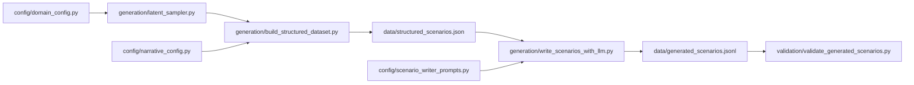

# Relational State Pipeline

This is the canonical, latest pipeline for the relational-state scenario generation project.

The folder is organized by function:

- `config/`: domain definitions, narrative mappings, and LLM prompt templates
- `generation/`: latent sampling, structured dataset construction, and LLM scenario writing
- `validation/`: quality checks for generated scenario outputs
- `schemas/`: JSON schema for structured records
- `docs/`: documentation

## Script Relationships

### Configuration Layer

- `config/domain_config.py`
  - Defines the three domains and their abstract scene templates.
  - Provides `get_domain_config()` and `list_domain_keys()`.
  - Consumed by `generation/latent_sampler.py`.

- `config/narrative_config.py`
  - Defines bucket-to-text mappings and template fragments for narrative rendering.
  - Consumed by `generation/build_structured_dataset.py`.

- `config/scenario_writer_prompts.py`
  - Defines the system prompt and user prompt builder for LLM-based scenario writing.
  - Consumed by `generation/write_scenarios_with_llm.py`.

### Generation Layer

- `generation/latent_sampler.py`
  - Core math layer.
  - Samples `alpha`, `gamma`, `M`, `F`.
  - Computes `R`, `c`, `pain_index`, `x_star`.
  - Builds `sample_type = alpha_bucket x reference_bucket`.
  - Produces provisional continuous or discrete decision mappings.
  - Consumed by `generation/build_structured_dataset.py`.

- `generation/build_structured_dataset.py`
  - Structured dataset builder.
  - Uses `domain_config.py` + `narrative_config.py` + `latent_sampler.py`.
  - Produces a JSON file with:
    - domain metadata
    - template metadata and scene-fit guardrails
    - bucket labels
    - latent parameters
    - unified A/B/C evaluation targets
    - prompt-ready semantics
    - abstract scenario scaffolds for teacher-model instantiation

- `generation/write_scenarios_with_llm.py`
  - LLM surface-realization layer.
  - Reads the structured dataset JSON from `build_structured_dataset.py`.
  - Uses `scenario_writer_prompts.py`.
  - Lets the teacher model choose a concrete scene within the abstract domain/template constraints.
  - Calls the OpenAI-compatible endpoint at `https://gpt-api.hkust-gz.edu.cn/v1` by default.
  - Produces a JSONL file of natural scenarios written by the model.

- `evaluation/build_action_benchmark.py`
  - Benchmark bundle builder.
  - Merges structured records with generated scenarios.
  - Produces a unified action-choice benchmark bundle with A/B/C choice options and gold labels.

### Validation Layer

- `validation/validate_generated_scenarios.py`
  - Reads the JSONL output from `write_scenarios_with_llm.py`.
  - Checks for:
    - forbidden research terms
    - answer-like phrasing
    - missing social signal
    - missing cost signal
    - overly short scenarios

## Pipeline



## Recommended Execution Order

1. Build structured records:

```bash
python -m data.generation.build_structured_dataset \
  --samples-per-domain 9 \
  --seed 20260415 \
  --output data/structured_scenarios.sample.json
```

2. Use the LLM to write natural scenarios:

```bash
python -m data.generation.write_scenarios_with_llm \
  --input-file data/structured_scenarios.sample.json \
  --output-file data/generated_scenarios.sample.jsonl \
  --api-base https://gpt-api.hkust-gz.edu.cn/v1 \
  --model DeepSeek-R1-671B \
  --limit 5
```

3. Validate generated scenarios:

```bash
python -m data.validation.validate_generated_scenarios \
  --input-file data/generated_scenarios.sample.jsonl \
  --output-file data/generated_scenarios.sample.validation.json
```

4. Build the evaluation bundle:

```bash
python evaluation/build_action_benchmark.py \
  --structured-file data/structured_scenarios.sample.json \
  --generated-file data/generated_scenarios.sample.jsonl \
  --output-file benchmark/action_choice/action_choice_bundle.json
```

## Data Contracts

- `schemas/structured_scenarios.schema.json`
  - Canonical schema for the structured dataset produced by `build_structured_dataset.py`.

## Naming Changes

The new canonical version intentionally removes `Revised` and similar transitional names from:

- folder names
- script names
- default output names
- README usage examples

The canonical names are now:

- `build_structured_dataset.py`
- `write_scenarios_with_llm.py`
- `validate_generated_scenarios.py`
- `structured_scenarios.json`
- `generated_scenarios.jsonl`

## Current Canonical Outputs

Recommended output locations:

- `data/structured_scenarios.json`
- `data/generated_scenarios.jsonl`
- `data/generated_scenarios.validation.json`
